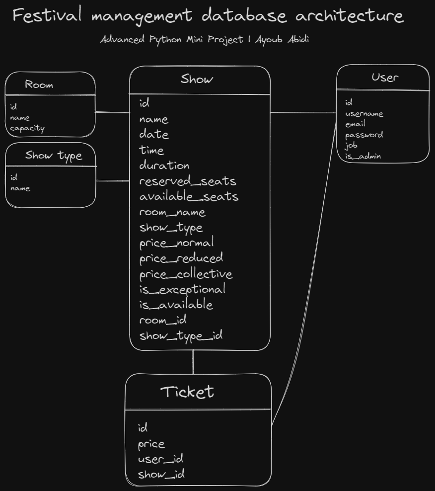

# Gestion de festival - Partie Backend (projet principal)
Ce projet représente le backend du projet de gestion des festivals, qui concentrait la quasi-totalité des efforts. Ce projet utilise le framework FastApi pour créer des api endpoints avec PostgreSQL comme base de données principale.
## Architecture de la base de données


### Architecture de projet
```
├── src
│ └── assets
│ └── constants
│ └── controllers
│     ├── admin
│     ├── user
│ └── database
│     ├── postgres_db.py
│     ├── redis_db.py
│ └── integration_tests
│ └── middleware
│     ├── auth_guard.py
│ └── migrations
│ └── models
│ └── routes
│     ├── admin
│     ├── user
│ └── schemas
│ └── unit_tests
│ └── utils
│ └── app.py
│ └── main.py
│ └── restful_ressources.py
```

### Exécuter le projet
Il n'est pas nécessaire d'installer quoi que ce soit sur votre machine à l'exception de docker. vous pouvez exécuter le projet simplement en lançant cette commande :
```shell
cd Backend
docker-compose up --build --force-recreate
```
## Tester la base de données

```shell
$ docker exec -it festival_db psql -U festival festival
psql (13.9 (Debian 13.9-1.pgdg110+1))
Type "help" for help.
```

## Tester l'API

Vous pouvez consulter la documentation Swagger sur http://localhost:8000.

```shell
$ curl localhost:8000/v1/health
{"alive":true,"ip":"172.21.0.1","status":"ok"}
```
