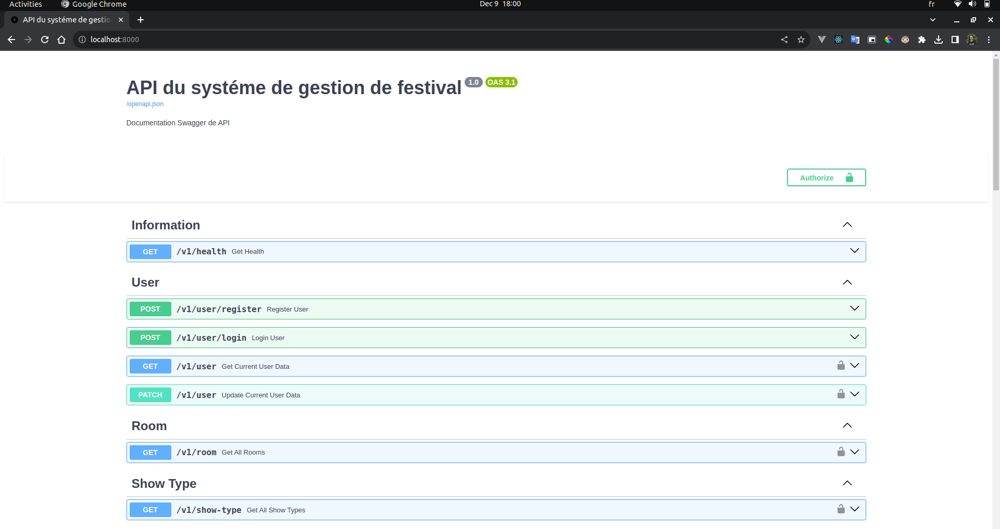
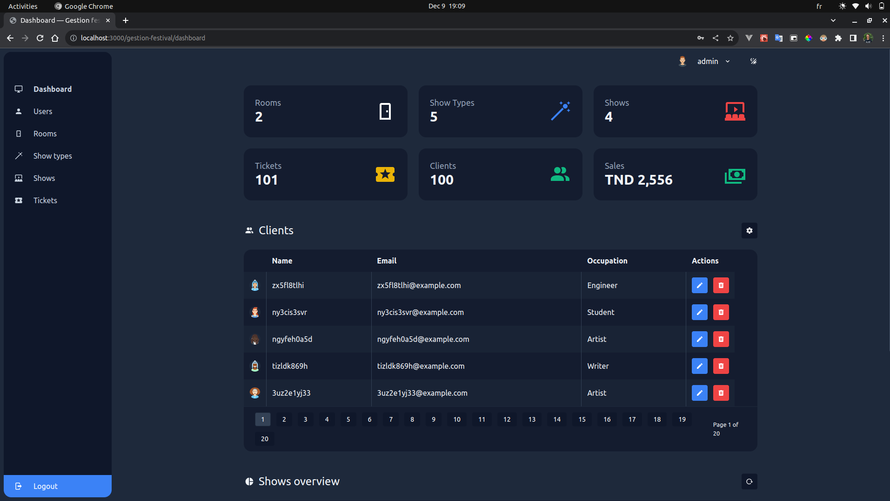

# Gestion de festival 
Ce projet est dédié à la matière mini projet: python avancé (Mastère Professionnel en Ingénierie du Logiciel - Open Source à l'ISI).

Ce projet est composé de deux projets:
* Le backend en tant que projet principal qui a été réalisé avec python.  

* Le frontend qui a été réalisé avec typescript.

Vous trouverez plus de détails sur la configuration et l'architecture de chaque projet dans un fichier README qui se trouve dans leur dossier.